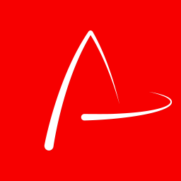

<p align="center">
  
</p>

<p align="center">
  <a aria-label="Maintained" href="https://img.shields.io/badge/maintained-yes-brightgreen">
    </img>
  </a>
  <a aria-label="Make a pull request" href="http://makeapullrequest.com">
    </img>
  </a>
  <a aria-label="License" href="https://github.com/JhonatanMedeiros/webview-angular-electron/blob/master/LICENSE">
    </img>
  </a>
</p>

<br>
# WebView Angular Electron

## 🖥 Introduction

The WebView Angular Electron is a Desktop Application, to manage multiples webview  

WebView Angular Electron with Angular 9 and Electron 8 (Typescript + SASS + Hot Reload) for Desktop applications.

Currently, runs with:

Angular v9.1.4
Electron v8.2.5
Electron Builder v22.6.0
With this sample, you can :

Run your app in a local development environment with Electron & Hot reload
Run your app in a production environment
Package your app into an executable file for Linux, Windows & Mac
/!\ Hot reload only pertains to the renderer process. The main electron process is not able to be hot reloaded, only restarted.

/!\ Angular 9.x CLI needs Node 10.13 or later to works correctly.

> The project use boilerplate from https://github.com/maximegris/angular-electron/

## ⌨️ Development

### Clone Code

```bash
git clone git@github.com:JhonatanMedeiros/webview-angular-electron.git
```

### Install Dependencies

```bash
npm install
```
> If you like [Yarn](https://yarnpkg.com/), you can also use `yarn` to install dependencies.


### Development

```bash
npm run start
```
> After run the command, the application open in new window.

```bash
npm run run ng:serve:web
```
> Navigate to http://localhost:4200/. The app will automatically reload if you change any of the source files.

### Build Release

|Command|Description|
|--|--|
|`npm run build`| Build the app. |
|`npm run build:prod`| Build the app with Angular aot. |
|`npm run electron:local`| Builds your application and start electron
|`npm run electron:linux`| Builds your application and creates an app consumable on linux system |
|`npm run electron:windows`| On a Windows OS, builds your application and creates an app consumable in windows 32/64 bit systems |
|`npm run electron:mac`|  On a MAC OS, builds your application and generates a `.app` file of your application that can be run on Mac |

After building, the application will be found in the `dist` directory.

## 🛠 Technology Stack

- [Angular 9x](https://angular.io/)
- [Electron](https://www.electronjs.org/)
- [Electron Builder](https://github.com/electron-userland/electron-builder)


# 🤝 Contribute

If you are interested in participating joint development, PR and Forks are welcome!
Read up on our guidelines for [contributing][contributing].

## 📜 License

[MIT][license] Copyright (c) 2020 - Jhonatan Hardt de Medeiros


[license-badge]: https://img.shields.io/badge/license-Apache2-blue.svg?style=style=flat-square
[license]: https://github.com/maximegris/angular-electron/blob/master/LICENSE.md
[prs-badge]: https://img.shields.io/badge/PRs-welcome-brightgreen.svg?style=flat
[prs]: http://makeapullrequest.com
[maintained-badge]: https://img.shields.io/badge/maintained-yes-brightgreen
[license]: https://github.com/JhonatanMedeiros/webview-angular-electron/blob/master/LICENSE
[contributing]: https://github.com/JhonatanMedeiros/webview-angular-electron/blob/master/CONTRIBUTING.md
